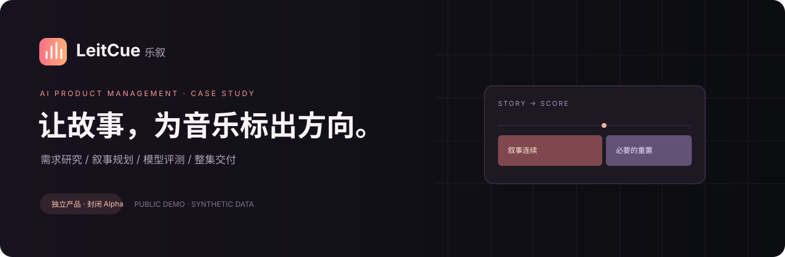
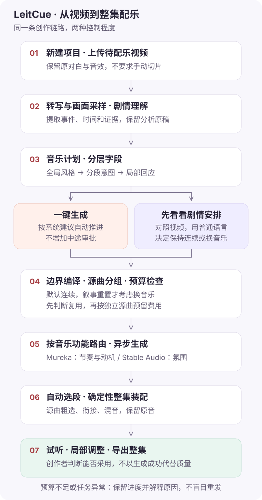
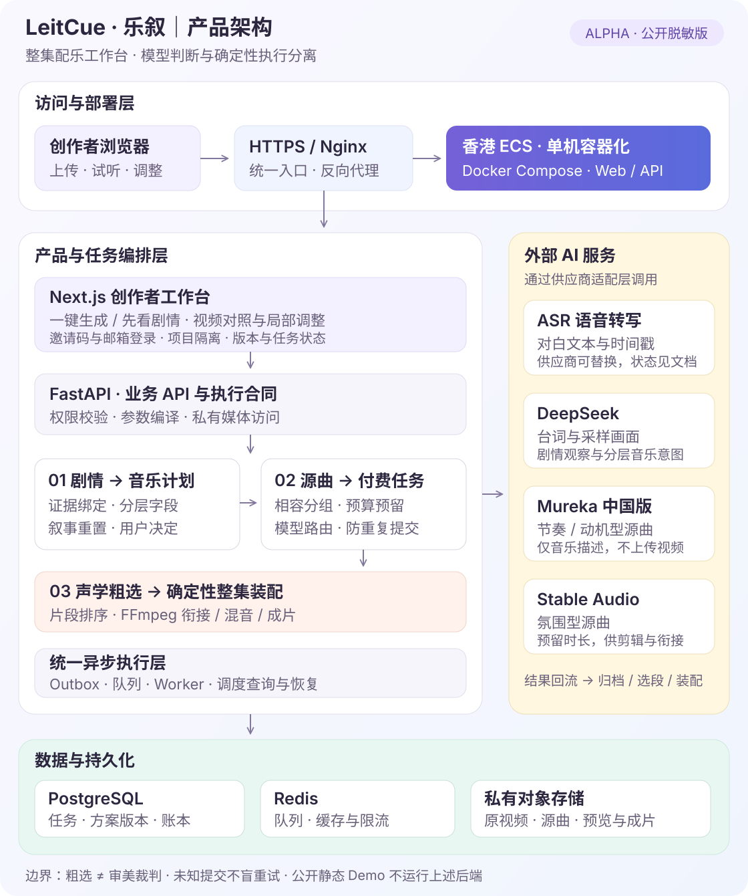

<p align="center"></p>

# LeitCue · 乐叙

**面向 AI 漫剧与剧情短视频的整集配乐工作台｜Demo**

把「找一首好听的歌」转化为「交付一集可以使用的配乐」：理解剧情，决定音乐何时连续、何时变化，调用合适的模型，再选段、衔接和导出。

[体验交互 Demo](https://dehydration630.github.io/leitcue-demo/) · [产品需求 PRD](docs/PRD.md) · [设计决策与复盘](docs/DECISIONS.md) · [架构与流程](docs/ARCHITECTURE.md) · [测试与验收](docs/TESTING.md)

## 30 秒了解项目

| 项目要素 | 内容 |
|---|---|
| 用户 | 独立漫剧／剧情短视频创作者和小团队，不要求具备音乐制作知识 |
| 核心任务 | 上传 30–180 秒定剪、待配乐视频，获得可试听、可调整、可导出的整集结果 |
| 痛点 | 曲库检索耗时；单首生成音乐的 intro、段落和结尾不匹配画面；多次重生成抬高成本 |
| 产品形态 | 一键生成 + 可选「先看看剧情安排」，视频与局部控制在同一屏 |
| 差异化假设 | 叙事规划、分层字段、按音乐功能路由、自动选段和确定性装配，而非单个音乐模型 |
| 核心评价 | 整集经 0–1 次修改后是否达到创作者可发布标准；导出不等于真实采用 |
| 我的工作 | 需求研究、实验设计与听评、产品取舍、字段／工作流设计、验收与上线组织 |
| AI 协作 | 使用 AI 编程工具协助实现与文档整理；关键产品判断和听评由项目负责人完成，不把 AI 生成代码包装成独立手写成果 |

## 建议阅读路径

**总览 / 3 分钟**：本页 → [一页案例](docs/CASE_STUDY.md) → [交互 Demo](https://dehydration630.github.io/leitcue-demo/)。

**产品视角 / 15 分钟**：[用户与问题](docs/RESEARCH.md) → [PRD](docs/PRD.md) → [为什么这样设计](docs/DECISIONS.md) → [评测与模型选型](docs/EVALUATION.md)。

**技术视角 / 20 分钟**：[字段合同](docs/FIELD_FRAMEWORK.md) → [架构](docs/ARCHITECTURE.md) → [可运行核心示例](examples/core.py) → [测试用例](docs/TESTING.md)。

## 三个最重要的产品判断

### 1. 好听的片段，不等于用户愿意采用

早期短片原型获得过积极反馈，但没有自然转化为完整作品采用。交付单位因此从 30 秒实验片段改为完整一集，评价从「某个卡点精彩」改为「整集能否直接使用」。[研究与证据边界 →](docs/RESEARCH.md)

### 2. 音乐变化是叙事决策，不是镜头计数

降低单段时长下限解决了短尾段无法换曲，却又导致分段过密。最终规则是**默认连续，持续的人物关系或场景重置才考虑换音乐**；数量上限不是要用满的配额。用户也可取消系统建议。[决策演进 →](docs/DECISIONS.md)

### 3. 不把模型不可控的问题全塞进提示词

长曲模型难以保证第一秒就是成熟节奏。产品改为生成完整 Source Track，再推荐适合的 Excerpt；氛围型和节奏型任务分配给不同后端。自动粗选是声学代理排序，**不是审美裁判，也不是精确强拍识别**。[模型与能力边界 →](docs/EVALUATION.md)

## 产品流程



## 产品架构

模型负责剧情观察与音乐创作，程序负责规则、成本、状态和整集交付。



[查看详细架构、状态机与数据血缘 →](docs/ARCHITECTURE.md)

## 交付物索引

| 文件 | 展示的产品能力 |
|---|---|
| [CASE_STUDY](docs/CASE_STUDY.md) | 从问题、假设、行动到结果，不用术语替代成果 |
| [RESEARCH](docs/RESEARCH.md) | 招募、访谈偏差、行为证据、采用验证 |
| [PRD](docs/PRD.md) | 用户故事、范围、优先级、规则和可验收需求 |
| [FIELD_FRAMEWORK](docs/FIELD_FRAMEWORK.md) | 证据 → 叙事 → 音乐意图 → 供应商参数的转换 |
| [ARCHITECTURE](docs/ARCHITECTURE.md) | 产品流程图、系统架构图、状态机、模型与确定性模块分工 |
| [EVALUATION](docs/EVALUATION.md) | 对照实验、失败案例、选型约束、避免过度推断 |
| [METRICS](docs/METRICS.md) | 北极星、漏斗、质量/成本/稳定性指标与埋点设计 |
| [DECISIONS](docs/DECISIONS.md) | MVP 取舍、反例驱动迭代、过度设计复盘 |
| [ROADMAP](docs/ROADMAP.md) | 已交付、当前限制、下一轮验证和退出条件 |
| [TESTING](docs/TESTING.md) | 需求到用例的追踪、离线与真实听评的区分 |
| [PUBLICATION](docs/PUBLICATION.md) | 公开范围、数据保护、示例与生产实现差异 |

## 运行与验证

无需 API Key、数据库或 npm 安装。

```bash
git clone https://github.com/Dehydration630/leitcue-demo.git
cd leitcue-demo
python3 -m http.server 8080
# 浏览器打开 http://localhost:8080
```

示例代码和测试仅依赖 Python 3.11+ 标准库；静态交互规则测试需 Node.js 18+。

```bash
python3 -m unittest discover -s tests -v
node --test tests/demo.test.mjs
python3 scripts/check_publication.py
```

示例重点：叙事边界收敛、字段继承、供应商路由、保守源曲去重、预算预留与重复提交防护。它们是为评审重写的教学实现，不能直接用作生产调度器。[示例说明 →](examples/README.md)

## About / English summary

LeitCue is an AI-assisted episode scoring product for dialogue-heavy short videos. This portfolio shows product discovery, evaluation-driven model routing, evidence-bound music planning, excerpt selection, cost controls and creator-in-the-loop design. The public demo is entirely synthetic and offline; it does not generate music. Implementation was developed with AI coding assistance. No adoption, revenue or retention metrics are claimed without evidence.

维护者：[Dehydration630](https://github.com/Dehydration630)。本仓库用于作品集展示，授权说明见 [NOTICE](NOTICE.md)。
