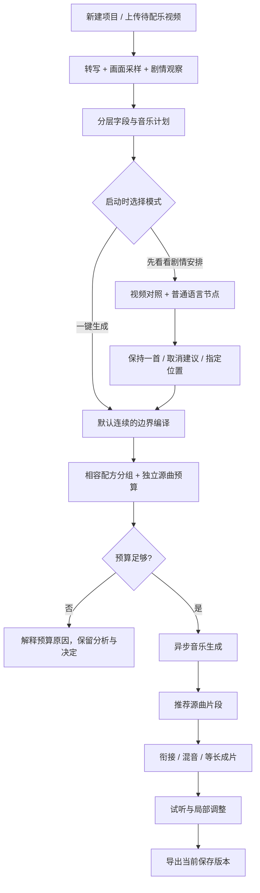
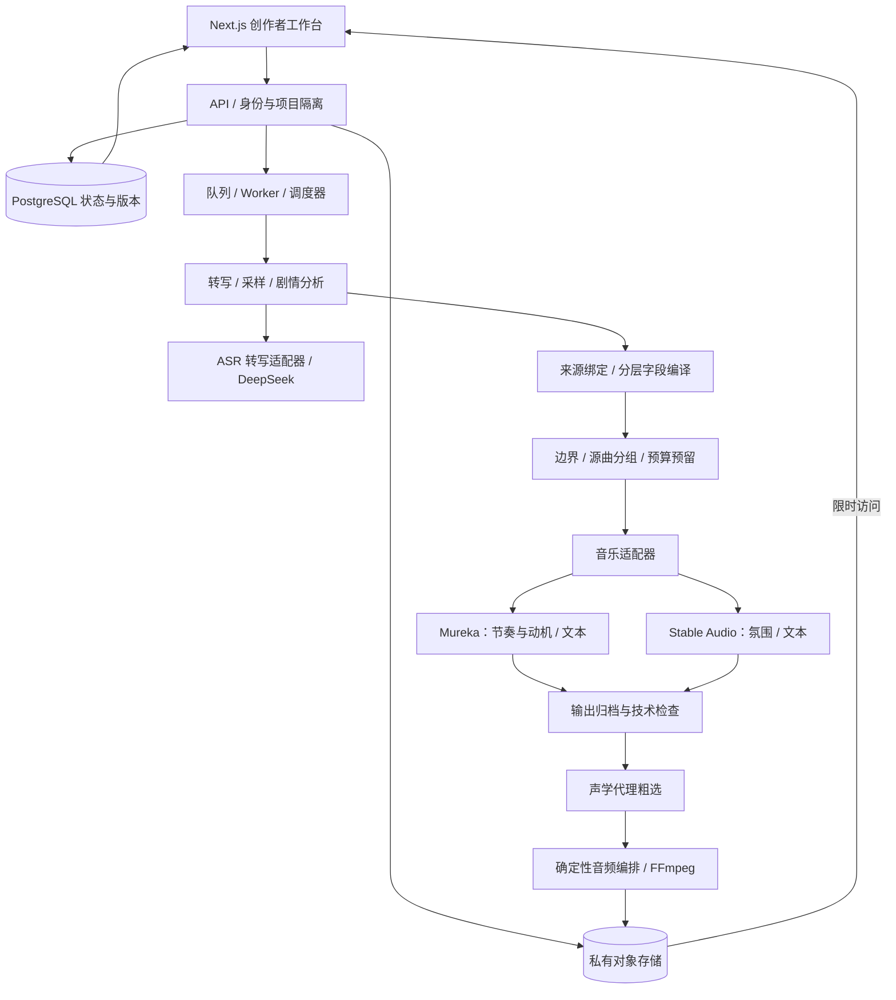
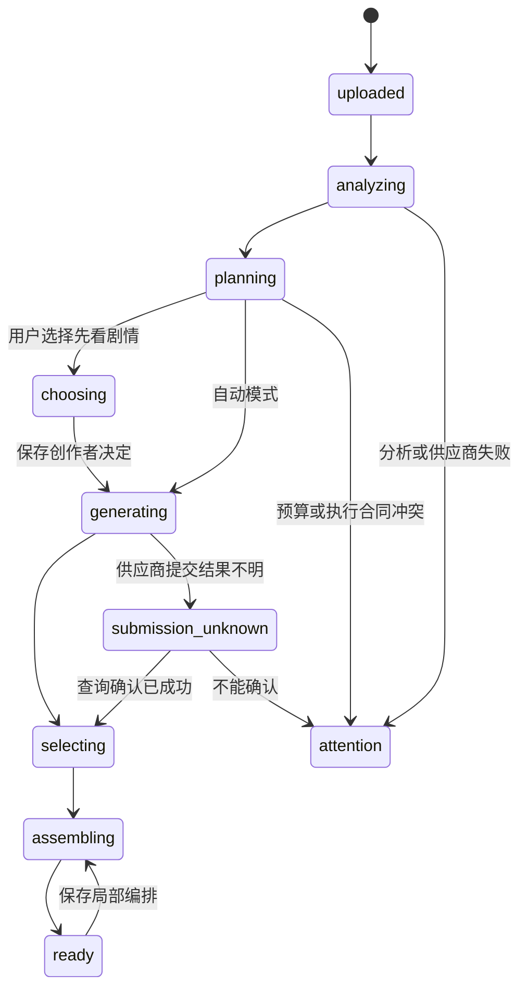
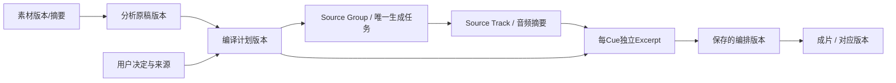

# 产品流程与系统架构

以下图展示真实 Alpha 的职责划分，省略具体域名、账户、网络和凭据。公开代码只是其中少量可测试规则，不包含生产服务。

## 1. 创作者流程：同一能力，两种控制程度

展开流程图的 Mermaid 文本版本（含预算分支）

## 2. 系统架构：让模型做判断，让程序负责执行

部署基线是香港 ECS 上的 Docker Compose 单机 Alpha，HTTPS 经 Nginx 接入 Next.js 与 FastAPI，不是参考排版案例中的 veFaaS 架构。PostgreSQL 保存业务状态，Redis 支持队列、缓存与限流，私有对象存储承载媒体；省略了具体资源与连接信息。

**ASR 状态（2026-09-21）**：线上最后确认版本仍使用 Eleven Scribe；Paraformer 的持久化接入已本地完成、发布准备完成，但尚未确认生产切换。图中以可替换的 ASR 适配层表示，避免将准备完成误写成已经上线。

展开系统依赖的 Mermaid 文本版本

**关键边界**：上游分析原稿不可被后处理改写；Cue不等于一次付费调用；生成结果不等于可发布；原视频不发送给当前文本Mureka链路；私有媒体访问与公开作品集完全隔离。

## 3. 状态机与失败恢复

`choosing` 是主动选择，不是错误。`submission_unknown` 不自动重发。可恢复失败与永久失败分开，保留已完成内容和费用账本。读状态、保存选段、重新混音不应触发新的生成。

## 4. 数据与血缘

需要避免：拿旧提示生成结果证明新字段有效；改了计划却下载旧成片；失败重试导致重复付费；用人工修订冒充模型原样输出。

## 5. 技术选择的产品理由

- Web工作台：降低安装成本，不把专业DAW当作用户必须依赖。
- 异步队列：生成耗时不阻塞页面，刷新后仍能恢复状态。
- 关系数据库与对象存储分离：任务可审计，媒体不通过数据库传输。
- 分供应商适配器：模型替换影响局部合同，不要求重写整个产品。
- 确定性编译与装配：可以测试、可重放；把音乐随机性限制在必须生成的部分。
- 不增加一个“万能Agent”：harness是来源、字段、工具权限、状态和反馈闭环的组合，不是多起几个模型就解决问题。
